<table>
<tr>
<td valign="top"></td>
<td valign="top"></td>
</tr>
</table>

## Abhinav Aby

**Creative Developer & Cloud Enthusiast · CSE @ SJCET PALAI**

 

<!-- animated contribution graph, refreshed daily by the workflow -->

